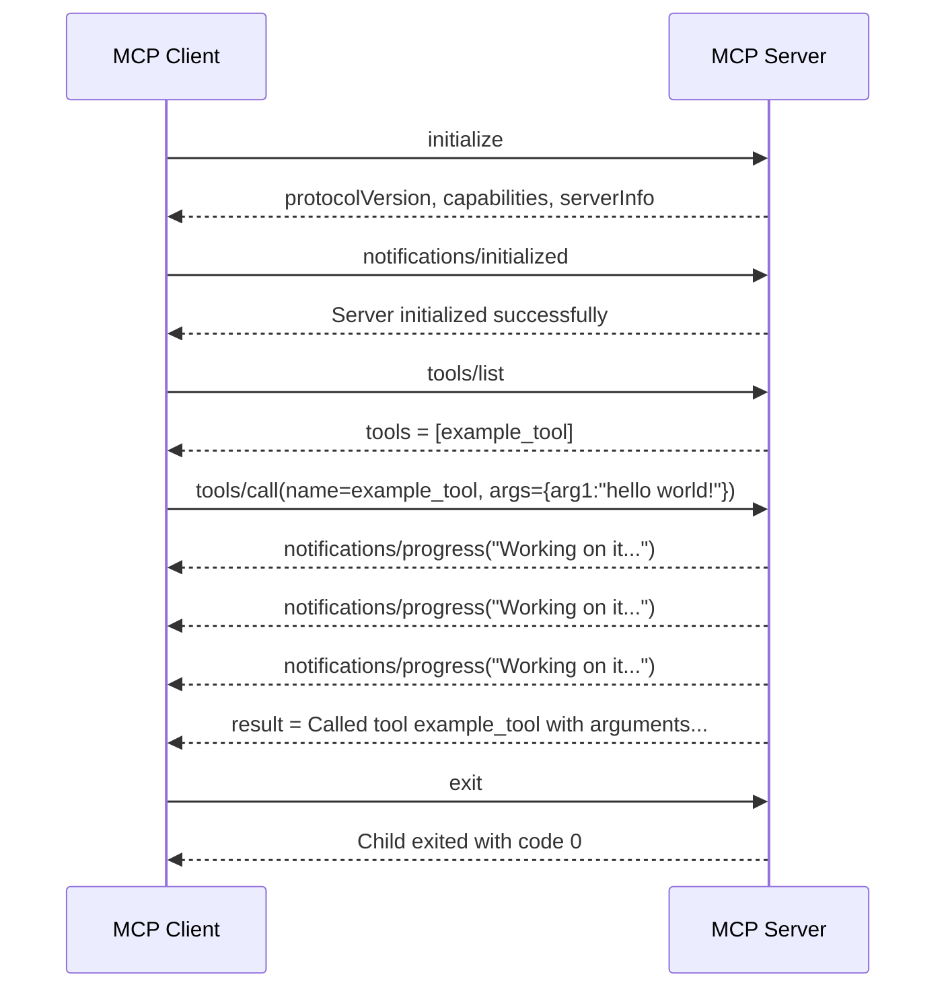
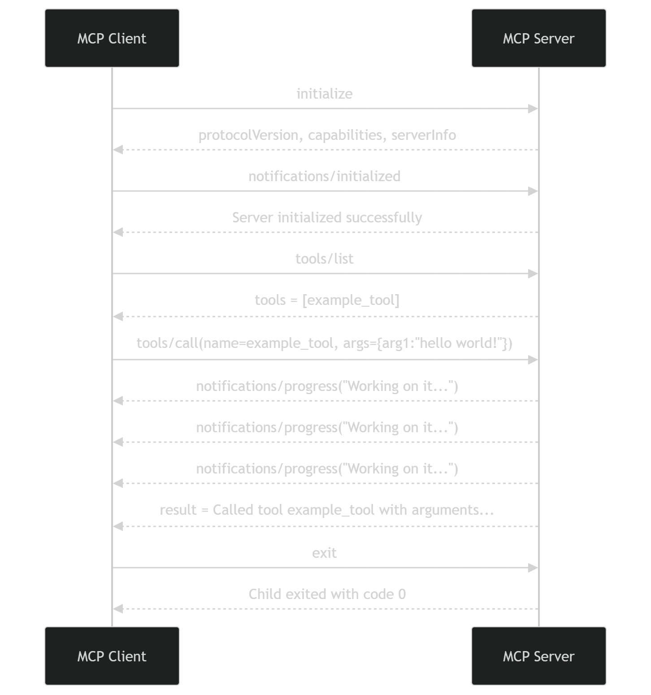

# Running the Client - Server

```
poetry run python mcp_playground/Chapter02/notificationsReportsUpdates/client.py
```



```mermaid
sequenceDiagram
    participant C as MCP Client
    participant S as MCP Server

    C->>S: initialize
    S-->>C: protocolVersion, capabilities, serverInfo

    C->>S: notifications/initialized
    S-->>C: Server initialized successfully

    C->>S: tools/list
    S-->>C: tools = [example_tool]

    C->>S: tools/call(name=example_tool, args={arg1:"hello world!"})

    S-->>C: notifications/progress("Working on it...")
    S-->>C: notifications/progress("Working on it...")
    S-->>C: notifications/progress("Working on it...")

    S-->>C: result = Called tool example_tool with arguments...

    C->>S: exit
    S-->>C: Child exited with code 0
```



