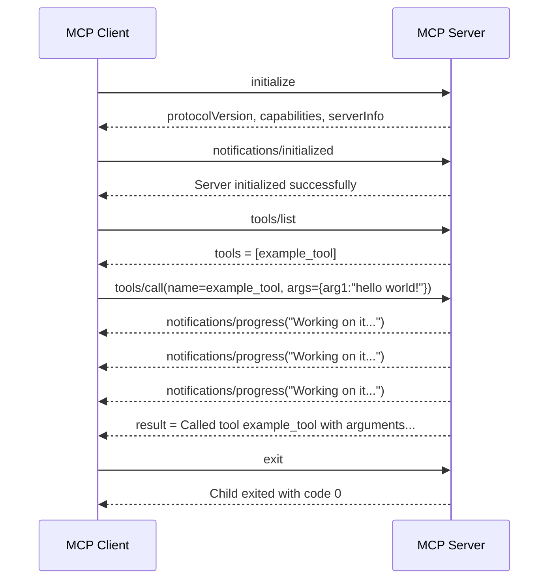

# MCP Client-Server Interaction Sequence

This sequence diagram presents the communication workflow between the MCP client and server during a complete request-response cycle. The process starts with the initialization stage, where the client sends an `initialize` request and the server returns the corresponding protocol version, supported capabilities, and server metadata. The client then confirms the successful establishment of the session through the `notifications/initialized` message.

Following initialization, the client requests the set of available tools by issuing a `tools/list` request. In response, the server provides the registered tool definitions, including `example_tool`. The client subsequently invokes this tool through a `tools/call` request, supplying the argument `arg1="hello world!"`. While the server is processing the request, it emits multiple `notifications/progress` messages, thereby informing the client that the operation remains active and has not yet completed. After processing is finished, the server sends the final result associated with the tool invocation.

From a protocol perspective, this interaction exemplifies the separation between progress notifications and final responses in MCP-based communication. Notifications are used to communicate intermediate execution status without terminating the request, whereas the final result message delivers the outcome of the tool call. The sequence concludes when the client sends the `exit` command and the server process ends.


# Running the Client - Server

```
poetry run python mcp_playground/Chapter02/notificationsReportsUpdates/client.py
```




