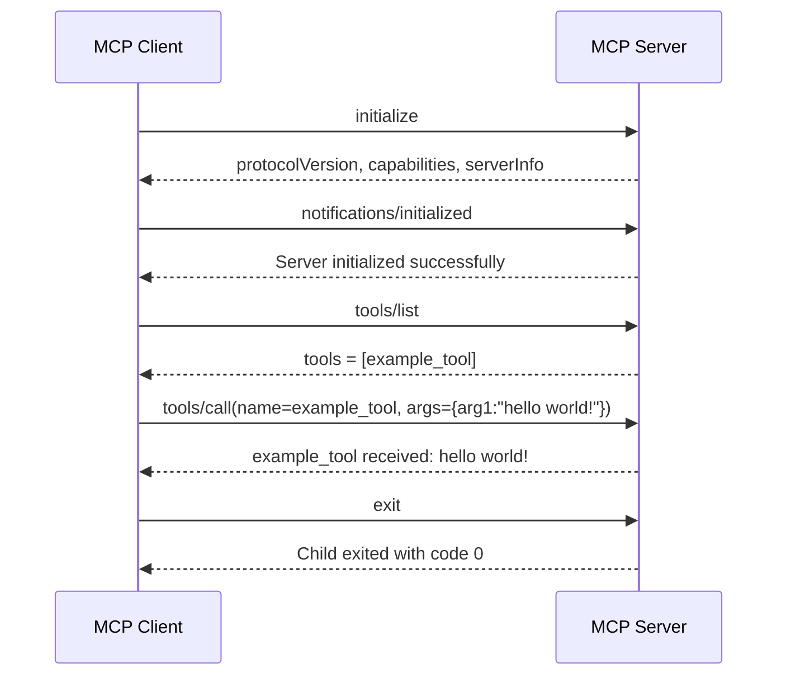

# Basic Client-Server Interaction Flow

This sequence diagram illustrates the basic interaction flow between the MCP client and server during initialization, tool discovery, and tool execution. The process begins when the client sends an `initialize` request, to which the server responds with its protocol version, supported capabilities, and server information. The client then confirms that the initialization phase has completed by sending the `notifications/initialized` message.

After the connection is established, the client requests the list of available tools through `tools/list`, and the server returns the registered tool definitions, including `example_tool`. The client subsequently invokes this tool by sending a `tools/call` request with the argument `arg1="hello world!"`. The server processes the request and immediately returns the result produced by the tool. Finally, the interaction ends when the client sends the `exit` command and the server process terminates.


# Running the Client - Server

```
poetry run python mcp_playground/Chapter02/supportingFeatures/client.py
```




