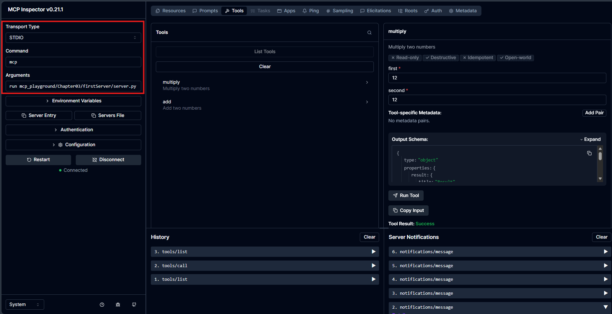

# MCP

## Concepts
The MCP (Model Context Protocol) server is structured around different key elements that allow you to interact and create functionalities [Chapter 3: Building and Testing Servers: Concepts]:

1. **Tools**: These are functions that you can invoke to perform specific operations. For example, you can create a tool to multiply two numbers or add two values. They are defined using decorators like `@mcp.tool()`.

2. **Resources**: These are endpoints you can access to retrieve information or responses related to a specific request. For instance, you can create a resource that returns a personalized greeting with a name provided in the request `@mcp.resource`.

3. **Prompts**: These are templates that allow interaction with the server by requesting an action to be carried out or code to be evaluated. They are registered with the decorator `@mcp.prompt()`.

The typical structure of an MCP server includes defining these tools, resources, and prompts, as well as managing dependencies and configuring the server environment before running it.


# Run the server
```
poetry run mcp dev mcp_playground/Chapter03/firstServer/server.py
```

Instalar 

Need to install the following packages:
@modelcontextprotocol/inspector@0.21.1

# Test with Inspector

Run inspector:
```
poetry run mcp dev mcp_playground/Chapter03/firstServer/server.py
```

Arguments: 
```
run mcp_playground/Chapter03/firstServer/server.py
```



# Test with CLI

## List tools
```
npx @modelcontextprotocol/inspector --cli mcp run mcp_playground/Chapter03/firstServer/server.py --method tools/list
```

## Call a tool

```
npx @modelcontextprotocol/inspector --cli mcp run mcp_playground/Chapter03/firstServer/server.py --method tools/call --tool-name multiply --tool-arg first=2 --tool-arg second=4
```

## List resources
### Resources
```
npx @modelcontextprotocol/inspector --cli mcp run mcp_playground/Chapter03/firstServer/server.py --method resources/list
```
### Templated Resources
```
npx @modelcontextprotocol/inspector --cli mcp run mcp_playground/Chapter03/firstServer/server.py --method resources/templates/list
```
### Call our templated resources:
```
npx @modelcontextprotocol/inspector --cli mcp run mcp_playground/Chapter03/firstServer/server.py --method resources/read --uri greeting://Julian
```

Resonse:
```
{
  "contents": [
    {
      "uri": "greeting://Julian",
      "mimeType": "text/plain",
      "text": "Resource greeting, Julian! This is a dynamic resource."
    }
  ]
}
```

### List prompts:
```
npx @modelcontextprotocol/inspector --cli mcp run mcp_playground/Chapter03/firstServer/server.py --method prompts/list
```

Response:
```
{
  "prompts": [
    {
      "name": "review_code",
      "description": "Review the provided code and provide feedback.",
      "arguments": [
        {
          "name": "code",
          "required": true
        }
      ]
    }
  ]
}
```

### Call a prompt 
```
npx @modelcontextprotocol/inspector --cli mcp run mcp_playground/Chapter03/firstServer/server.py --method prompts/get --prompt-name review_code --prompt-args code="print('Hello world Julián')"
```

```
{
  "description": "Review the provided code and provide feedback.",
  "messages": [
    {
      "role": "user",
      "content": {
        "type": "text",
        "text": "Please review this code:\n\nprint('Hello world Julián')."
      }
    }
  ]
}
```

### Call another resource
```
npx @modelcontextprotocol/inspector --cli mcp run mcp_playground/Chapter03/firstServer/server.py --method resources/read --uri command://ping
```

```
{
  "contents": [
    {
      "uri": "command://ping",
      "mimeType": "text/plain",
      "text": "pong"
    }
  ]
}
```

