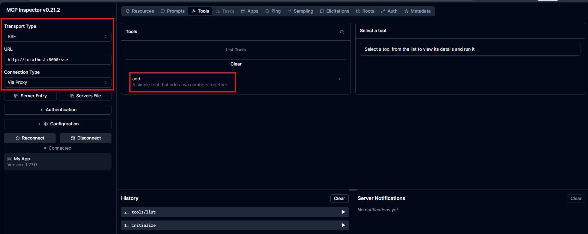

## Running the SSE MCP Server with Inspector

To test the MCP server over SSE, first start the correct ASGI application. In this example, the MCP SSE server is exposed by `server.py`, not by `main.py`.

Run the server with:

```bash
poetry run uvicorn mcp_playground.Chapter04.sseServer.server:app --reload
```

Server up:
```bash
INFO:     Will watch for changes in these directories: ['C:\\DevJulian\\mcp\\mcp-playground']
INFO:     Uvicorn running on http://127.0.0.1:8000 (Press CTRL+C to quit)
INFO:     Started reloader process [16184] using StatReload
INFO:     Started server process [59708]
INFO:     Waiting for application startup.
INFO:     Application startup complete.
INFO:     127.0.0.1:51395 - "GET /sse HTTP/1.1" 200 OK
```

After the server is running, open MCP Inspector 

```
poetry run mcp dev mcp_playground/Chapter04/sseServer/server.py
```

and configure it with the following values:

Transport Type: SSE
URL: http://localhost:8000/sse
Connection Type: Via Proxy

It is important to use the /sse endpoint, because this is the route exposed by the MCP server for Server-Sent Events communication. If main.py is executed instead of server.py, or if the URL is configured as http://localhost:8000 without /sse, the Inspector will not be able to establish a valid MCP connection.

When the configuration is correct, the Inspector should connect successfully and allow you to inspect the server tools, resources, and prompts.


